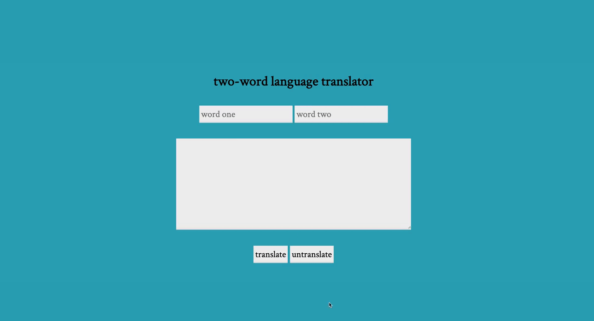

# two-word language translator

Invent your own two-word language!

Enter the two words in your dictionary into the text inputs, then add your message to the textarea. Only ASCII characters are supported.
